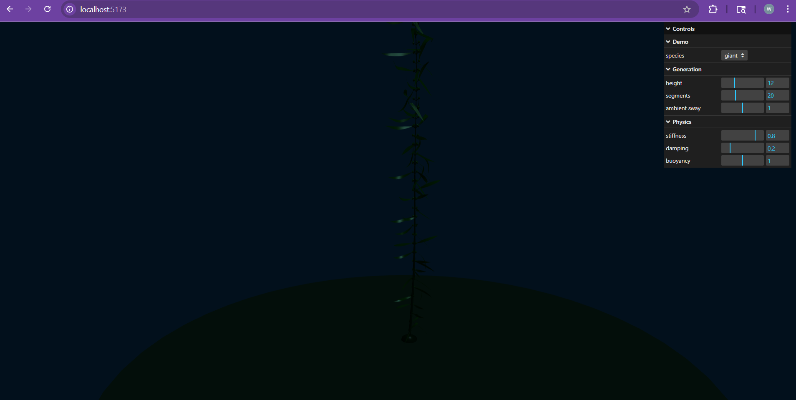
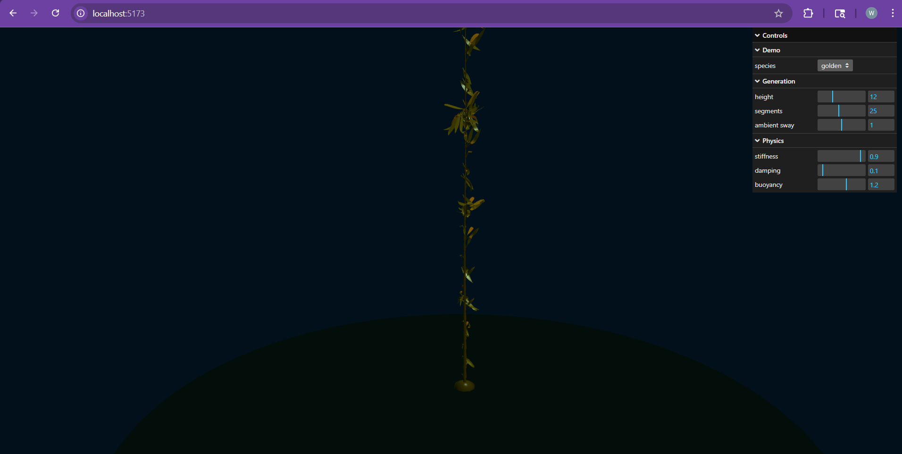

# Kelp Forest Project Report

**Author:** William Wu
**Date:** 4/30/2026

## Background

- This project focuses on procedurally generating and animating kelp in an underwater environment.
- Kelp forests are a good graphics subject because they combine:
  procedural plant structure, continuous motion, buoyancy, and visual material effects.
- The main generation method is an L-system style approach:
  a simple starting string is expanded with rewrite rules, then interpreted as kelp structure.
- This makes it possible to define different species through different:
  growth rules, branching patterns, segment counts, and frond dimensions.
- Motion is important because kelp behaves differently from trees:
  it is shaped by water movement, buoyancy, and drag rather than gravity alone.
- To model that behavior, the project uses:
  Verlet integration and position-based constraints for spring-like motion.
- Visual appearance also matters because kelp blades are thin and somewhat translucent, while stipes and bulbs are thicker.
- Because of that, the project includes species-specific material settings and basic underwater scene lighting.

## What I Accomplished

SUMMARY: Procedural generation, species variation, real-time physics sim, and interactive parameter control in a working prototype.

- Produced an interactive underwater kelp forest demo in TypeScript using Three.js.
- Created a complete procedural generation pipeline that can grow kelp (stipes, blades, bulbs, and holdfasts).
- Supported multiple species:
  Giant Kelp, Bull Kelp, and Golden Kelp.
- Tuned the species so their proportions/features better match reference descriptions, including:
  long broad Giant Kelp blades with small pneumatocysts, Bull Kelp with one floating bulb and many long narrow blades, and Golden Kelp without bulbs.
- Added simulated motion that makes the kelp respond like underwater vegetation rather than rigid plants, combining flexible stems, moving blade chains, buoyancy, and layered water motion.
- Included blade collision handling so neighboring blades do not pass through one another as easily during motion.
- Built a simple underwater presentation scene with lighting, fog, a seafloor, and first-person controls so the kelp can be viewed in context.
- Added interactive controls so the demo can be adjusted live by changing species, plant height, segment count, ambient sway, stiffness, damping, and buoyancy.

Still incomplete from the original proposal:
  mouse dragging and collision interaction, plus more advanced underwater shader effects.

## Artifacts Produced

- Runnable WebGL application built with TypeScript and Three.js
- Source code for:
  procedural generation, L-system logic, structure interpretation, physics simulation, and GUI controls
- Species configuration data for:
  Giant Kelp, Bull Kelp, and Golden Kelp

Visual Examples:
- Giant Kelp:
  

- Bull Kelp:
  

- Golden Kelp:
  

Main implementation files:
- `kelpgen/src/kelp/LSystem.ts` - rule-based procedural string generation
- `kelpgen/src/kelp/kelpStructure.ts` - interprets the generated string into kelp structure data
- `kelpgen/src/kelp/kelpSpecies.ts` - species-specific growth, material, and physics parameters
- `kelpgen/src/physics/physics.ts` - Verlet-style motion, buoyancy, layered water forces, constraints, and blade collisions
- `kelpgen/src/gui/gui.ts` - interactive parameter controls and controller registration
- `kelpgen/src/main.ts` - scene setup, rendering, lighting, GUI-to-regeneration wiring, and app integration

## References

- Position Based Dynamics: https://matthias-research.github.io/pages/publications/posBasedDyn.pdf
- Advanced Character Physics: https://www.cs.cmu.edu/afs/cs/academic/class/15462-s13/www/lec_slides/Jakobsen.pdf
- Interactive Modeling of Plants: https://graphics.uni-konstanz.de/publikationen/Lintermann1999InteractiveModelingPlants/Lintermann1999InteractiveModelingPlants.pdf
- The Algorithmic Beauty of Plants: https://algorithmicbotany.org/papers/abop/abop.pdf
